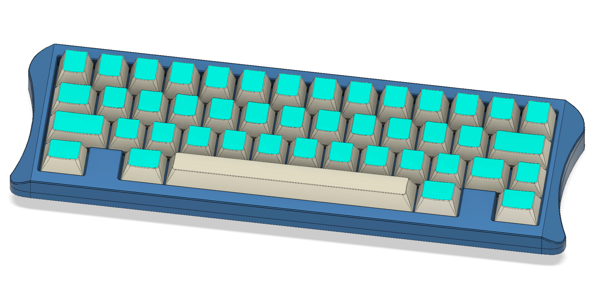
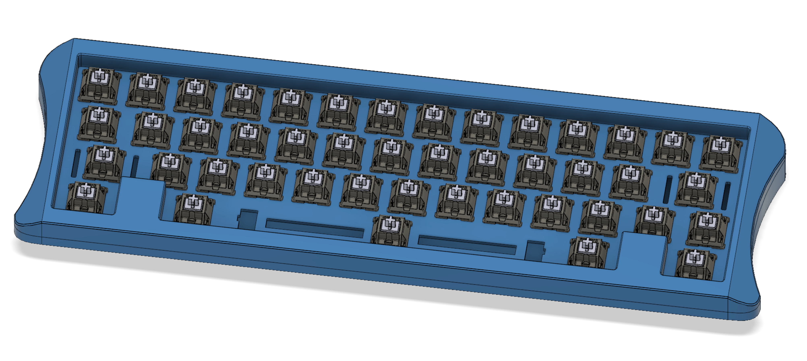

# MrKeebs Fusion 360 Scripts

This is a collection of Fusion 360 scripts I created to automate some aspects of mechanical keyboards design. The scripts are not necessarely complete but should work for most cases.

To install the scripts, make sure you copy the contents of the root folder to the appropriate folder on your OS:

**macOS** - `~/Library/Application Support/Autodesk/Autodesk Fusion 360/API/Scripts`

**Windows** - `%appdata%\Autodesk\Autodesk Fusion 360\API\Scripts`

For more information please refer to the [How to install an ADD-IN and Script in Fusion 360?](https://knowledge.autodesk.com/search-result/caas/sfdcarticles/sfdcarticles/How-to-install-an-ADD-IN-and-Script-in-Fusion-360.html) article on Autodesk's website.

## Keycaps Script

This scripts will insert all the keycaps to complete a KLE layout. In order to make it work, you need to create a new project in Fusion 360 and include all STEP files from Hinney Bush's CherryMX models from here: https://github.com/hineybush/CherryMX.

Make sure you import all the files from the subfolders (r1 through r4) inside the STEP folder. Once that's done, just open `Keycaps.py` using your favorite editor and change the LAYOUT string to the KLE layout of your choice and then just run the script.

## CopyMX Script

This script basically copies MX switches following a layout string based on the [Keyboard Layout Editor (KLE)](http://www.keyboard-layout-editor.com) website standard. You need to manually edit the script and replace the LAYOUT string with the desired layout.

In order for the script to work, you need to have the first switch component already in place and it needs to be named "MX Series-Cherry Key". You can download the switch STEP file from here: https://grabcad.com/library/cherry-mx-series-key-keycap-1.
